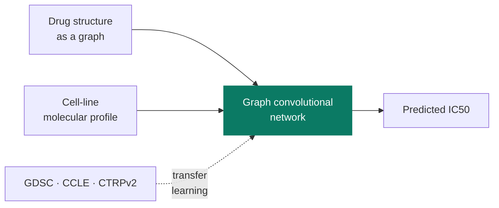

<h1>Training Cancer Drug-Response Models in TensorFlow</h1>

<strong>The base predictor — no ensembling, no intervals. This is the model the later work combines.</strong>

Ved Piyush · PhD in Statistics · University of Nebraska–Lincoln

---

**What it predicts.** Given a cancer cell line and a drug, how sensitive is that cell line to that drug —
reported as **IC50**, the drug concentration needed to halve cell growth. Lower means more sensitive.

**How.** A **graph convolutional network** reads the drug's chemical structure as a graph of atoms and bonds, while
the cell line's molecular profile enters as separate inputs. This follows the published DeepCDR architecture.

This repository contains **only the base model**. It performs no ensembling and produces no prediction intervals —
that work lives in the companion repositories.

## How it fits together

## What the code does

Training runs across four public drug-screening datasets: **GDSC-1 and GDSC-2** (Genomics of Drug Sensitivity
in Cancer), **CCLE** (Cancer Cell Line Encyclopedia) and **CTRPv2** (Cancer Therapeutics Response Portal).

Two training regimes are compared: learning from scratch (`From_Scratch_Learning_on_GDSC_2.py`) and **transfer
learning**, where a model trained on one dataset is adapted to another (`Transfer_Learning_on_GDSC_2`). Several
notebooks keep dropout active during training in a way that supports later uncertainty estimation
(`train_deepcdr_gcn_dropout_in_train*`).

Performance is reported as Spearman correlation, R² and mean squared error. Data loading goes through
`improve_utils.py`, from Argonne National Laboratory's IMPROVE framework for benchmarking drug-response models.

## Running it

1. `get_sample_data.ipynb` pulls a small sample to check the data path works.
2. `train_deepcdr_gcn*.ipynb` trains the graph convolutional model.
3. `Transfer_Learning_on_GDSC_2` adapts a trained model to a second dataset.
4. `Get_Joint_Learner_GDSC_*_Preds.ipynb` writes out predictions for downstream use.

## Where to look first

- **`train_deepcdr_gcn.ipynb`** — the base model, trained from scratch
- **`Transfer_Learning_on_GDSC_2.ipynb`** — adapting a trained model to a second dataset

## Notes

> Notebook outputs are committed, so the figures and result tables render on GitHub without running anything. Screening datasets are downloaded through `improve_utils`; trained weights and scheduler logs are not committed.

Research code from my doctoral work at the University of Nebraska–Lincoln (8 notebooks). Previously hosted at `github.com/Ved-Piyush/DeepCDR_TF`.

---

**Ved Piyush, PhD** · [Website](https://vedpiyush93-stack.github.io) · [Google Scholar](https://scholar.google.com/citations?hl=en&user=657rVYAAAAAJ) · [vedpiyush93@gmail.com](mailto:vedpiyush93@gmail.com)

